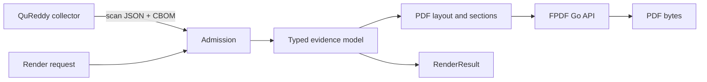

<!-- SPDX-License-Identifier: PolyForm-Noncommercial-1.0.0 -->

# BreachSAFE PDF

[](https://github.com/paul007ex/breachsafe-pdf/actions/workflows/ci.yml)
[](https://github.com/paul007ex/breachsafe-pdf/actions/workflows/codeql.yml)
[](go.mod)
[](LICENSE)
[](REUSE.toml)

Reusable Go PDF compiler for evidence-backed quantum-readiness reports.

BreachSAFE PDF accepts exact QuReddy scan JSON, an exact CycloneDX 1.7 CBOM, and a
bounded render request. It validates the source bytes and their correlation, projects
them into a typed report model, and emits a human-readable PDF plus a machine-readable
`RenderResult` receipt.

The compiler is the renderer and admission boundary. Collection, OSCAL interpretation,
ePack composition, signing, delivery, tenancy, and identity management remain in the
calling product.

## Contents

1. [Quickstart](#quickstart)
2. [Architecture](#architecture)
3. [Contracts](#contracts)
4. [Tool provenance](#tool-provenance)
5. [Security boundary](#security-boundary)
6. [Enterprise integration boundary](#enterprise-integration-boundary)
7. [Current producer limitation](#current-producer-limitation)
8. [Documentation](#documentation)
9. [Development](#development)
10. [License](#license)

## Quickstart

Build the repository image:

```bash
docker build \
  --build-arg REPORT_VERSION=0.1.1 \
  --tag breachsafe-pdf:local \
  .
```

Verify the binary identity:

```bash
docker run --rm breachsafe-pdf:local --version
```

Render the checked-in fixture without network access:

```bash
RUN_DIR="$PWD/.run-fixture"
mkdir -p "$RUN_DIR"
cp examples/community-single-scan.request.json "$RUN_DIR/request.json"
cp internal/admission/testdata/success.cbom.json "$RUN_DIR/scan.cdx.json"
cp internal/admission/testdata/success.scan.json "$RUN_DIR/scan.json"

docker run --rm \
  --user 65532:65532 \
  -v "$RUN_DIR:/work/run:rw" \
  breachsafe-pdf:local \
  render --profile breachsafe/community \
  --request /work/run/request.json \
  --cbom /work/run/scan.cdx.json \
  --scan-json /work/run/scan.json \
  --pdf /work/run/report.pdf \
  --result /work/run/report.result.json
```

Verify the receipt and PDF metadata:

```bash
jq -r '[.pdf.sha256, .pdf.pages, .generator.version,
  .renderer.version] | @tsv' "$RUN_DIR/report.result.json"
pdfinfo "$RUN_DIR/report.pdf" | egrep 'Pages|JavaScript|Encrypted'
```

For a live QuReddy-to-PDF run, follow the [quickstart](docs/quickstart.md) or the
[container pipeline](docs/how-to/container-pipeline.md).

## Architecture



The call path is:

```text
external producer containers
  -> cmd/evidence-report
  -> evidenceapp.RenderFiles
  -> admission.Admit
  -> evidence.Canonicalize and Validate
  -> pdf.Renderer.Render
  -> codeberg.org/go-pdf/fpdf
  -> PDF + RenderResult
```

The CLI is thin. The application layer owns sequencing, bounds, digesting, and paired
output. The PDF package owns presentation. FPDF is called as a Go library API. The
PDF compiler does not invoke QuReddy, OpenSSL, a shell, a network client, or a template
interpreter.

See the [architecture explanation](docs/explanation/architecture.md) and the
[Go call reference](docs/reference/library-api.md).

## Contracts

| Input or output | Contract |
| --- | --- |
| Render request | `breachsafe.report.request.community-single-scan/v1alpha1` |
| Scan JSON | `qureddy.scan.v1` |
| CBOM | CycloneDX 1.7 JSON, `application/vnd.cyclonedx+json` |
| PDF | A4 or Letter, color or grayscale |
| Receipt | `breachsafe.report.render-result/v1alpha1` |

The request declares expected SHA-256 values for the CBOM and scan JSON. Admission
rejects missing paths, symlinks, unsupported schemas, invalid references, oversized
inputs, digest mismatches, and uncorrelated producer documents by default.

## Tool provenance

The orchestrator observes versions at runtime:

```bash
qureddy --version
openssl version
breachsafe-pdf --version
```

The producer CBOM and scan JSON preserve collector versions. The PDF binary exposes
its own build version and records the FPDF renderer version in RenderResult. External
versions are not guessed by the report compiler.

## Security boundary

The runtime image is a minimal scratch image running as UID 65532. It contains the
compiled binary and embedded assets. The compiler uses regular-file checks, bounded
reads, exact-byte digests, fixed local assets, fail-closed correlation, and paired
output writes.

The compiler does not prove endpoint ownership, producer honesty, evidence
completeness, signer identity, PDF authenticity, or compliance. Tagged PDF, PDF/A,
complex-script shaping, encryption, and digital signatures are unsupported in the v1
profile and reported as explicit capability results.

## Enterprise integration boundary

The compiler is suitable as a deterministic worker inside an enterprise service. The
calling control plane owns SSO, Okta claims, tenant authorization, RBAC, retention,
object storage, encryption, signing, and download audit. The PDF worker receives a
pre-authorized, tenant-scoped run directory and must not receive identity tokens or
arbitrary commands.

## Current producer limitation

QuReddy currently selects one machine output format per invocation. Separate JSON and
CBOM invocations create separate scan IDs. QuReddy issue [#430](https://github.com/BreachSAFE/qureddy/issues/430)
tracks a producer-native one-run output mode. Until it ships, serialize both formats
from one saved `ScanResult` and require `matched` relationships.

## Documentation

- [Documentation index](docs/README.md)
- [Quickstart](docs/quickstart.md)
- [First report tutorial](docs/tutorials/first-report.md)
- [Container pipeline](docs/how-to/container-pipeline.md)
- [Troubleshooting](docs/how-to/troubleshooting.md)
- [CLI reference](docs/reference/cli.md)
- [Input and output contracts](docs/reference/contracts.md)
- [RenderResult reference](docs/reference/render-result.md)
- [Architecture](docs/explanation/architecture.md)
- [Security](docs/explanation/security.md)
- [Go library reference](docs/reference/library-api.md)
- [Release gates](docs/contributors/release-gates.md)
- [Contributing](CONTRIBUTING.md)
- [Security policy](SECURITY.md)

## Development

```bash
GOTOOLCHAIN=go1.26.6 CGO_ENABLED=0 go test ./...
GOTOOLCHAIN=go1.26.6 CGO_ENABLED=0 go test -race ./...
go vet ./...
go mod verify
./scripts/run-gates.sh
```

Generated PDFs, scan runs, ePacks, binaries, and rendered images belong in external
versioned run directories. They are not committed to this source repository.

## License

First-party source and documentation use `PolyForm-Noncommercial-1.0.0`. Third-party
components retain their original licenses. See [`LICENSE`](LICENSE), [`NOTICE`](NOTICE),
and [`REUSE.toml`](REUSE.toml).
