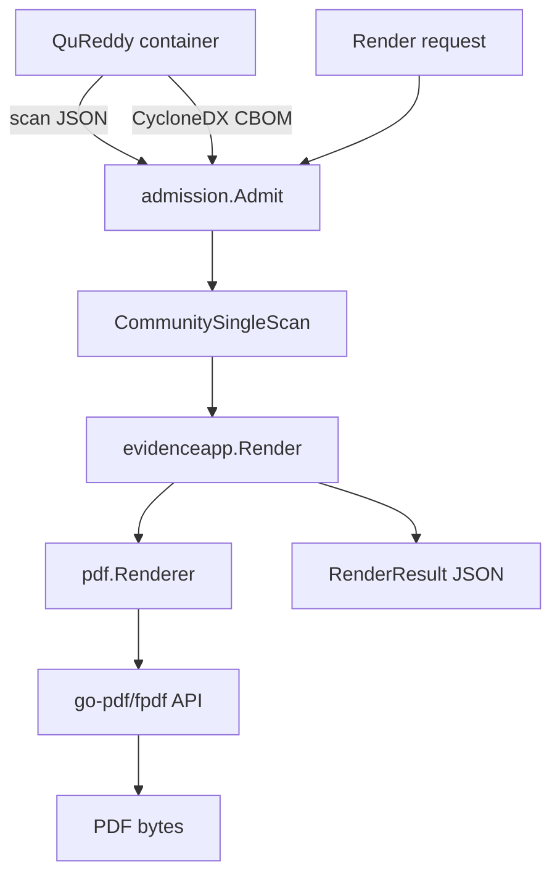

<!-- SPDX-License-Identifier: PolyForm-Noncommercial-1.0.0 -->

# Architecture

## Dependency direction



The Mermaid diagram is a navigation aid. The plain-text path below is the
authoritative dependency description and remains readable in terminals and source
archives.

```text
External producer containers
  QuReddy + OpenSSL
          │ scan JSON + CBOM + log
          ▼
cmd/evidence-report
  thin argument and signal boundary
          │
          ▼
internal/evidenceapp
  file limits, admission orchestration, canonicalization,
  validation, digesting, atomic output
          │
          ├──────────────► internal/admission
          │                 schema, digest, reference,
          │                 and correlation checks
          │
          ├──────────────► internal/evidence
          │                 source-neutral typed report model
          │
          ▼
internal/pdf
  layout, sections, typography, assets, pagination
          │
          ▼
codeberg.org/go-pdf/fpdf
          │
          ▼
PDF bytes + RenderResult JSON
```

The arrows represent calls and data flow. The PDF compiler does not call QuReddy,
OpenSSL, OSCAL, ePack, a database, or a network endpoint.

## The application middle layer

`internal/evidenceapp` is the application layer between the CLI and renderer. It
owns the sequence that must remain consistent for every caller:

1. Read bounded regular files.
2. Admit exact input bytes.
3. Canonicalize the report model.
4. Validate the complete model.
5. Calculate model and request digests.
6. Invoke the renderer interface.
7. Persist PDF and RenderResult as a pair.

This makes the renderer reusable from another Go caller without duplicating the
admission or output rules.

### File ownership

| File or package | Owns | Does not own |
| --- | --- | --- |
| `cmd/evidence-report/main.go` | Flags, signals, exit code, JSON stdout | Evidence semantics or PDF layout |
| `internal/evidenceapp` | Workflow sequencing and paired output | Producer-specific parsing rules |
| `internal/admission` | Input schemas, correlation, source projection | Fonts, pagination, network access |
| `internal/evidence` | Typed model, bounds, canonicalization, digests | Wire-format acquisition |
| `internal/pdf` | FPDF setup, sections, typography, pagination | QuReddy or CBOM parsing |
| `internal/assets` | Embedded fonts, icons, visual provenance | Caller-supplied paths |
| `internal/output` | No-clobber paired persistence | Report interpretation |

## Presentation layer

`internal/pdf` receives only `evidence.CommunitySingleScan`. It does not know the
wire shape of QuReddy JSON or CycloneDX. The renderer constructs an FPDF document,
registers embedded fonts and assets, creates a layout, and composes sections in a
fixed order.

The section code owns presentation decisions such as headings, cards, tables,
pagination, colors, icons, and footers. It does not make new evidence claims.

## Tool provenance boundary

The orchestrator runs each tool's version command and records the observed output.
The producer CBOM and scan JSON preserve collector versions. The PDF binary reports
its own build identity through `--version` and RenderResult. The renderer consumes
these identities; it does not execute arbitrary version commands during rendering.

This boundary keeps reports deterministic and prevents a PDF request from becoming
an implicit command-execution interface.

## Current v1 limitation

QuReddy currently selects one machine output format per CLI invocation. Running JSON
and CBOM commands separately creates separate scan IDs. The producer-native fix is
tracked in [QuReddy issue #430](https://github.com/BreachSAFE/qureddy/issues/430).
Until that ships, the orchestrator must serialize both formats from one saved
`ScanResult` and reject mismatched pairs.

## Extension points

The current renderer is intentionally internal. A future public library API should
expose a typed request and a typed document result, while retaining these invariants:

1. Admission happens before presentation.
2. The renderer receives a source-neutral model, never arbitrary template text.
3. Inputs and outputs are bounded and digestable.
4. A report and its RenderResult are written as one output pair.
5. External tools are invoked by the caller, not by the PDF library.
