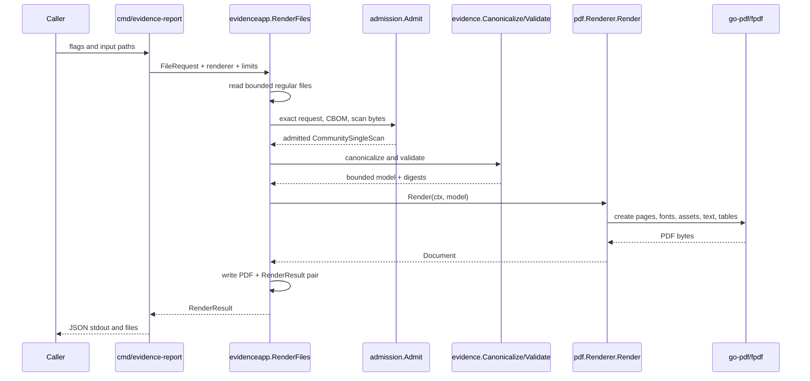

<!-- SPDX-License-Identifier: PolyForm-Noncommercial-1.0.0 -->

# Go library and call reference

The repository's public operational entrypoint is the `evidence-report` binary.
The current Go packages are internal, but their boundaries define the v1 design.

## CLI call graph



## File request types

From `internal/evidenceapp/render.go`:

```go
type FileRequest struct {
    RequestPath  string
    CBOMPath     string
    ScanJSONPath string
    PDFPath      string
    ResultPath   string
}

type Build struct {
    GeneratorVersion string
    GeneratorCommit  string
}
```

## Renderer boundary

```go
type Renderer interface {
    Ready() bool
    Render(context.Context, CommunitySingleScan) (Document, error)
}

type Document struct {
    Bytes              []byte
    MediaType          string
    Pages              int
    RendererName       string
    RendererVersion    string
    GeneratorVersion   string
    FontBundleName     string
    FontBundleSHA256   string
    AssetBundleSHA256  string
    Capabilities       []CapabilityResult
}
```

The boundary keeps admission and output policy independent from FPDF. A future
renderer can implement the same interface while retaining the evidence model.

## FPDF calls

`internal/pdf/renderer.go` uses FPDF as a library API:

```go
pdf := fpdf.New("P", "mm", pageSize, "")
pdf.SetCatalogSort(true)
pdf.SetCompression(true)
pdf.SetAutoPageBreak(false, 0)
pdf.AddUTF8FontFromBytes(fontFamily, "", goregular.TTF)
pdf.AddUTF8FontFromBytes(fontFamily, "B", gobold.TTF)
pdf.RegisterImageOptionsReader(...)
layout := newLayout(ctx, pdf, model, modelDigest, renderer, icons)
layout.registerFurniture()
layout.compose()
pdf.Output(&output)
```

No template language, reflection-driven field lookup, remote resource, or caller
file path reaches this layer.
